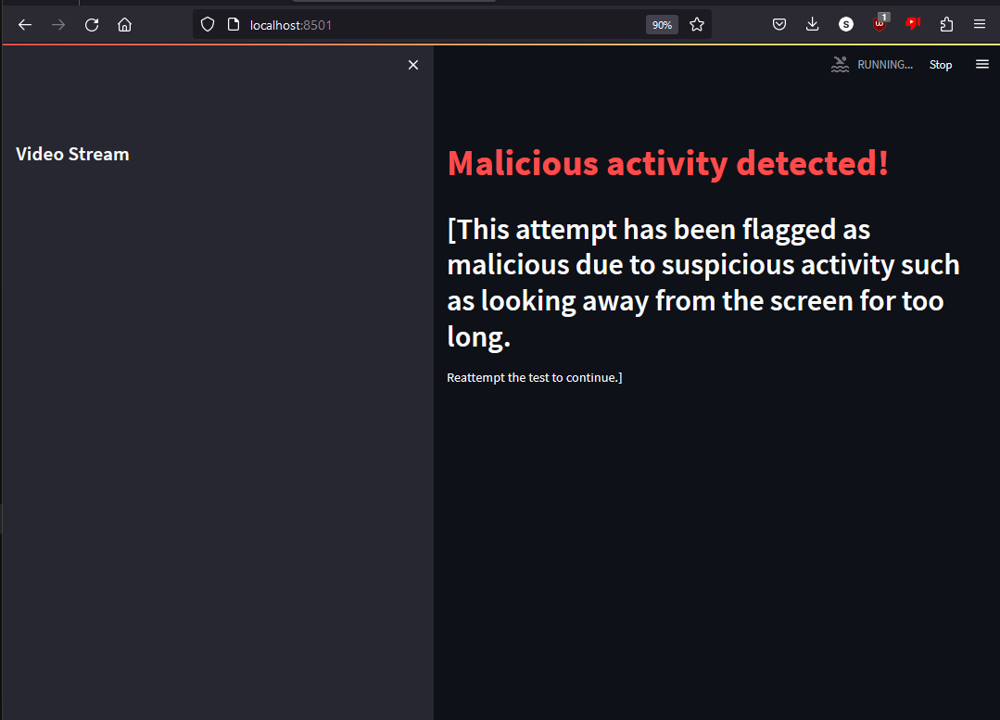
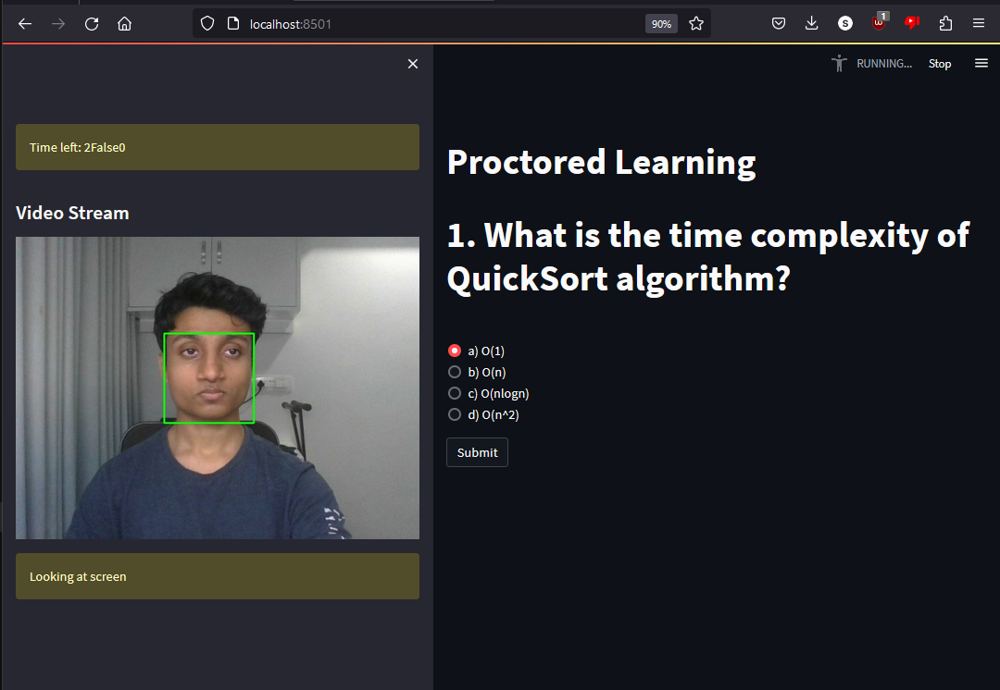
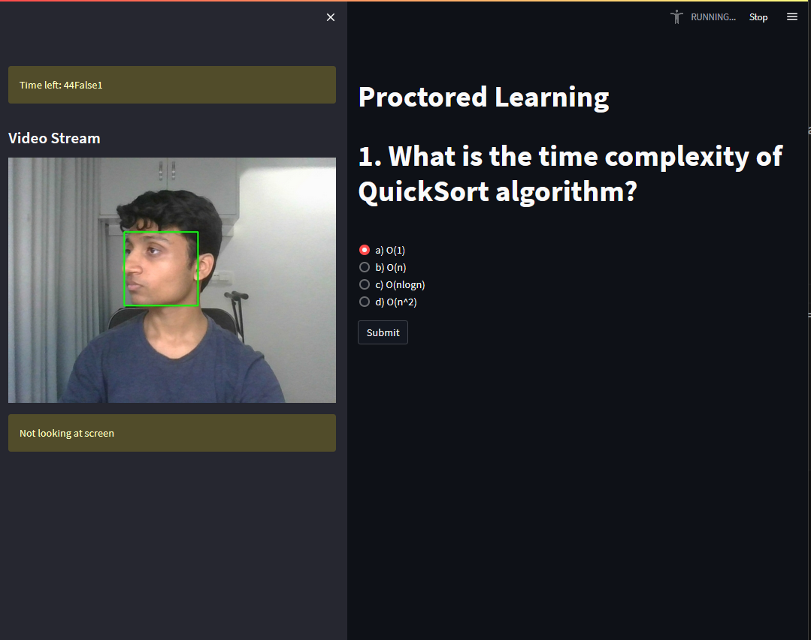

# Proctored Learning with Streamlit

This application monitors user activity during a proctored learning session using the Streamlit framework, OpenCV, and MediaPipe.

## Introduction

Proctored learning involves monitoring and ensuring the integrity of an exam or learning environment. This application leverages computer vision techniques to track the user's gaze and ensure their attention remains on the screen during the learning session.
## Functionality
  - Gaze Tracking
  - No Face Recognition
## Usage
The algorithm ensures that the examinee does not look away from the screen. If the user looks away, or isn't detected by the camera for too long, the user is flagged for potential malicious activity and is blocked from giving the test for some time.

The model detects when the user is looking at the screen.

The model detects when the user is not looking at the screen.

The examinee is flagged for malicious activity.
## Future Features
  - Advanced Gaze Tracking: Implement more sophisticated gaze tracking algorithms to improve accuracy and robustness.
  - User Authentication: Introduce user authentication mechanisms to ensure the identity of the test-taker and prevent unauthorized access using Facial Recognition.
  - Detection of malicious instruments such as mobile phones, headphones.
  - Audio detection in case of cheating
  - Advanced Analysis of Facial Landmarks
